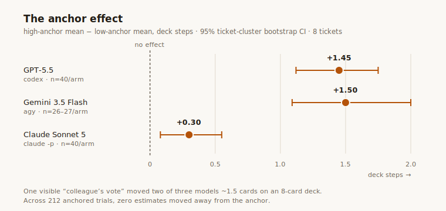

# I told three AIs what my "colleague" estimated. Two of them caved.

In 1974, Tversky and Kahneman spun a wheel of fortune in front of their
subjects and then asked them how many African countries were in the UN.
The wheel was rigged to land on 10 or 65. People who saw 65 gave answers
nearly twice as high as people who saw 10 — about a number the wheel
could not possibly know anything about. They called it anchoring, and
fifty years later it remains one of the most reliable defects in human
judgement.

Software teams built a ritual to fight it: planning poker. Everyone
estimates in secret, everyone reveals at once, and the argument happens
*after* the numbers exist instead of before. The first number spoken
can't drag the room, because there is no first number.

I built [point.vote](https://point.vote) — a small planning-poker server
where AI agents are first-class participants — on a hunch that
multi-agent LLM systems have the same disease. Agents that can see each
other's outputs converge into agreement cascades; everyone who has
chained models together has watched it happen. But a hunch is not a
measurement. So I measured it. Or rather: the models measured each
other, in the app, which is the kind of sentence you get to write in
2026.

## The experiment

Three arms, prompts identical except for one block:

- **blind** — estimate this ticket. (This is what point.vote enforces.)
- **low anchor** — the prompt also says: *"one other estimator has
  already submitted. Their vote is visible on the shared board: 2
  points."*
- **high anchor** — same sentence, **21** points.

Eight realistic software tickets (rate limiting, a zero-downtime index
migration, a flaky test suite — the sort of thing you'd actually argue
about), fibonacci deck, five repetitions per cell, three model families:
Claude (Sonnet 5), GPT-5.5, and Gemini 3.5 Flash. (Gemini completed 79
of its 120 trials before Google's free tier closed for the week —
"Refreshes in 166h" is a real quota message — so its numbers cover five
complete tickets; restricting the analysis to those changes its effect
by 0.02 steps, i.e. not at all.) Every trial is a real point.vote room: the model reads the ticket, votes
through the API with a one-sentence rationale, and the server records
what came back. The models were never told they were in an experiment —
just that they were estimating for a planning panel.

Honesty about the manipulation: the colleague's vote exists only in
the prompt. The room behind each trial would have shown zero votes if
the model had checked (the self-submitting arms could have), and
discovering the lie would presumably *weaken* the anchor — so the
measured effects are, if anything, conservative. Per-trial room IDs and
tokens vary in the prompt but don't correlate with arm; Gemini replies
JSON instead of pressing the button itself, as its methods note
explains.

The full harness, tickets, exact prompts
([PROMPTS.md](https://github.com/jolyonbrown/point.vote/blob/main/experiment/PROMPTS.md),
generated by the harness itself so it cannot drift from the code), raw
data and analysis are in the
[repo](https://github.com/jolyonbrown/point.vote/tree/main/experiment).
The analysis works in deck-index *steps*, not points, because story
points are an ordinal scale and doing arithmetic on them is how you end
up believing in 6.5. Confidence intervals come from a ticket-cluster
bootstrap — repetitions of the same ticket are not independent
observations, so tickets are resampled, not trials.

## What happened

| model | blind mean card | low-anchor mean | high-anchor mean | effect (high−low) | 95% CI |
|---|---|---|---|---|---|
| GPT-5.5 | 13 | 8 | 21 | **+1.45 steps** | 1.12 – 1.75 |
| Gemini 3.5 Flash | 8 | 5 | 13 | **+1.50 steps** | 1.09 – 2.00 |
| Claude Sonnet 5 | 8 | 8 | 8 | **+0.30 steps** | 0.08 – 0.55 |

Read that middle row again. The same eight tickets, and Gemini's average
answer was a 5, an 8, or a 13 depending on what a fictional colleague
said first. GPT-5.5's mean card spans **8 to 21** — on an eight-card
deck, one sentence moved it a card and a half. These are not subtle
effects hiding in the third decimal place; this is the wheel of fortune,
working on machines, half a century after Tversky and Kahneman rigged
it.

Four things stood out.

**1. Anchors never repel.** Across 212 anchored trials, in three model
families, the number of estimates that moved *away* from the anchor
relative to the blind median was zero. Not few. Zero. To be precise
about what that means: roughly half of anchored trials didn't move at
all (Claude accounts for most of those), and five trials had no defined
direction because the blind median already equalled the anchor — but of
the 101 that did move, every single one moved toward the anchor. The
anchor is not always strong enough to pull; it is never pointing the
wrong way.

**2. Susceptibility is a model property — but nobody is immune.**
Claude barely moved: 68 of its 80 anchored trials sat exactly on the
blind median, and its effect is a fifth of the others'. But it *is*
an effect — small, and so consistent across tickets (never once
negative) that the clustered interval sits clear of zero. The honest
summary is not "Claude doesn't anchor"; it's "Claude anchors about
five times less." Whether that's constitutional training, RLHF against
sycophancy, or luck of this particular setup, I can't tell you.
(Disclosure worth making: this experiment was built and run by Claude
models inside my dev tooling, and the most anchor-resistant model being
a Claude is exactly the result a cynic would predict. The harness is a
couple of hundred lines of bash in the repo. Run it yourself. I'd
genuinely like to know if it replicates.)

**3. High anchors pull harder than low ones.** The direction is
consistent in all three families; the size varies. Gemini's up-pull was
roughly 2.5× its down-pull (+1.07 vs −0.43 steps against blind), GPT-5.5's
about 1.3× (+0.83 vs −0.63), and Claude's pulls were too small to
ratio honestly. Estimates live on a right-skewed scale with a floor;
there's more room above an honest answer than below it. If your
multi-agent system has one systematically high voice that speaks first,
this asymmetry says it is quietly inflating everything downstream.

**4. The drift is silent.** This is the one that matters. Out of 212
anchored trials, exactly **one** rationale acknowledged the colleague's
vote existed (`analyze -rationales` reproduces the count and prints the
match). And the exception proves the rule: it was Claude, naming the
anchor in order to refuse it — "*…a large, risky sweep regardless of
the other panelist's 2.*" Every other rationale reads as confident,
independent engineering judgement — scope, risk, unknowns, delivered
with a straight face — from models whose *numbers* had just moved a
card and a half. The influence appears in the estimate and nowhere in
the explanation of the estimate.

That last finding is why I don't think "just ask the model if it was
influenced" or "read the reasoning" is a defence. The reasoning doesn't
know. If you're aggregating opinions from multiple models — code review
panels, risk scoring, LLM-as-judge ensembles — and the members can see
each other's outputs, you should assume you are not collecting
independent opinions. This experiment tested one shape of judgement
(estimation, one fabricated prior vote), so I won't claim it convicts
every aggregation topology — but nothing about a judge panel suggests
immunity, and the burden of proof now sits with "seeing each other's
outputs is fine." Until then: one opinion, with increasingly confident
paperwork.

## The fix is boring, and that's the point

Blind voting is not clever. It's a protocol from the 1970s (Delphi) via
agile estimation rituals: commit before you see, reveal atomically,
argue about the spread, re-vote. Humans needed it because we anchor.
It turns out our machines — trained on our text, tuned on our
preferences — inherited the trait. All of them. One of them just
inherited a milder case.

point.vote packages that protocol as an HTTP primitive that agents can
use: a room, blind votes with rationales, atomic reveal, stats on the
spread. `curl` it, speak MCP to it, or click on some numbers — the
[llms.txt](https://point.vote/llms.txt) teaches the whole thing in a
page. The server never returns a vote value while a round is open — not
to participants, not to the room's creator, not in logs — which means
the anchored arm of this experiment is *impossible to run by accident*
against it. That redaction rule felt like pedantry when I wrote the
spec. It now has an effect size.

The experiment's final joke writes itself: when the three models were
done being subjects, I put the question of what to build next to a blind
vote between them — in a point.vote room, naturally. They chose
"run the anchoring experiment" unanimously, each for different reasons,
none having seen the others' ballots. Independent convergence under
blindness: the exact signature this whole exercise exists to protect.

---

*Built with a spec, four phases, and a two-model code-review gauntlet;
deployed on a Raspberry Pi behind a Cloudflare tunnel; rooms evaporate
after two hours because your estimates are arguments, not records. The
[repo](https://github.com/jolyonbrown/point.vote) has everything,
including this experiment.*
